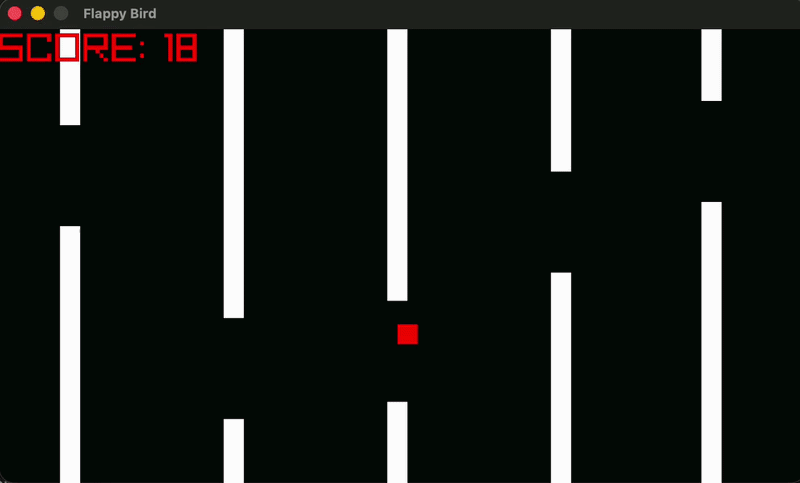

# Flappy Bird (ARM64 + Raylib)

A minimal Flappy Bird-style game implemented entirely in ARM64 assembly. This project demonstrates low-level game development concepts such as rendering, input handling, physics, and collision detection without relying on high-level abstractions.

---
## Demo
<div align="center">

</div>

---
## Features

* Basic Flappy Bird gameplay
* Rectangle-based rendering (no textures or sprites)
* Gravity and jump mechanics
* Procedurally generated obstacles
* Collision detection
* Score tracking
* Simple game loop using a fixed frame rate
* “Game Over” state
---
## Controls

* **Spacebar** : Make the bird jump

---
## Technical Overview

* Written in ARM64 assembly
* Uses an external graphics/input library "raylib" (for functions like `InitWindow`, `DrawRectangle`, `IsKeyDown`, etc.)
* Game state (position, velocity, obstacles, score) is manually managed on the stack
* Rendering is done using simple colored rectangles:

  * Bird: red square
  * Obstacles: white vertical bars
* Physics:

  * Constant gravity
  * Upward impulse on key press
  * Velocity clamped to a maximum value
* Obstacles:

  * Move horizontally across the screen
  * Recycled when off-screen
  * Heights randomized using `rand`
---
## File Structure

* `main.asm` : Main game implementation including

  * Initialization
  * Game loop
  * Input handling
  * Physics updates
  * Collision detection
  * Rendering
  * Cleanup
---
## Building

You need:

* An ARM64-compatible assembler (e.g., `clang` on macOS)
* A graphics library "raylib" providing the external functions used

Build using the bash file:
```
chmod +x assemble.sh
./assemble.sh
```

---
## Notes

* No assets (images/audio) are used-everything is drawn procedurally.
* No menus, UI system, or restart logic is implemented.
* The project focuses on understanding low-level mechanics rather than polish.

---
## Limitations

* No sound effects or music
* No restart or menu system
* Hardcoded values for gameplay tuning
* Minimal error handling


This is a small experimental project intended for learning and exploration of assembly-level programming in a game development context.
